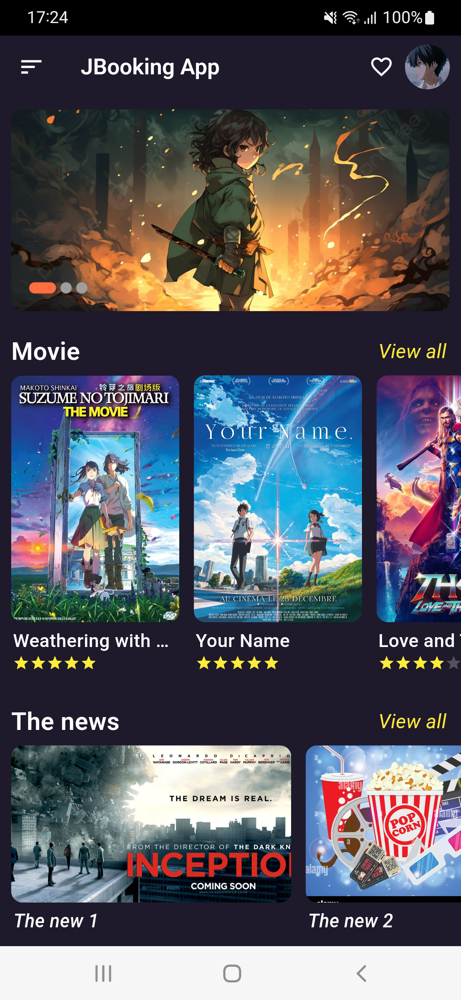
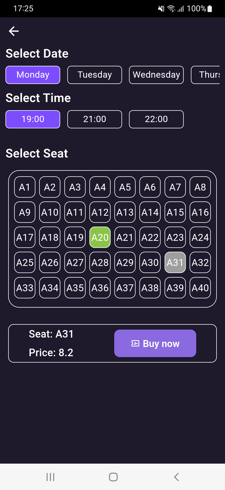
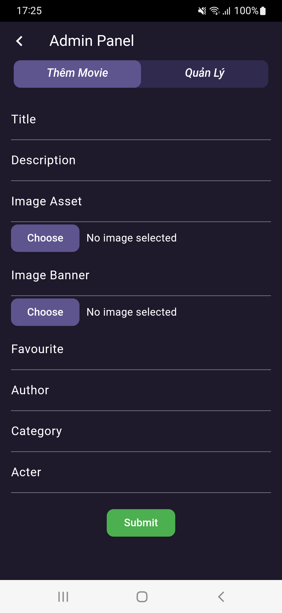
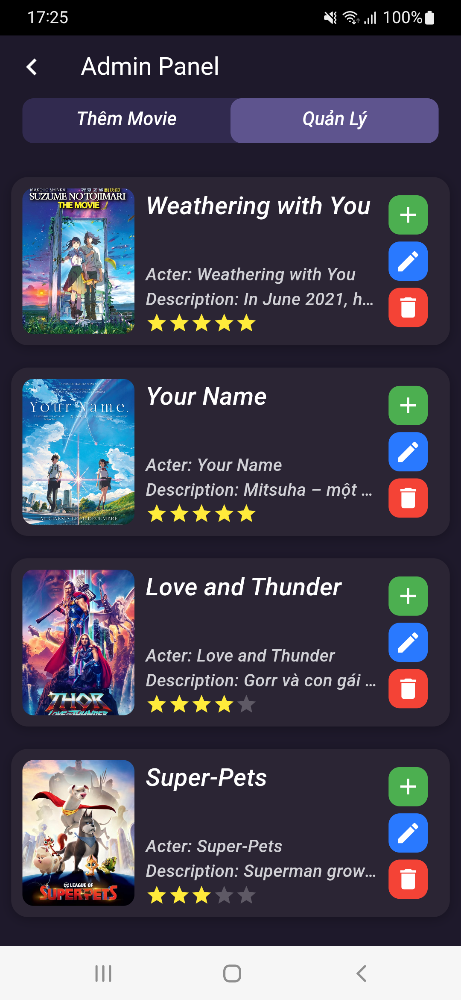
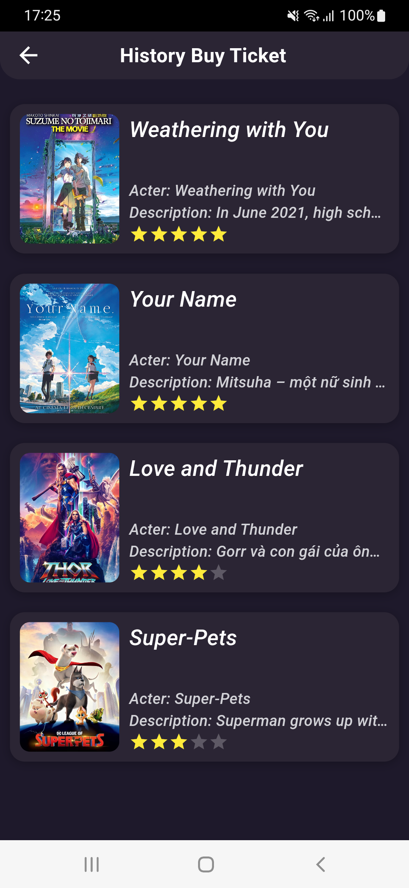
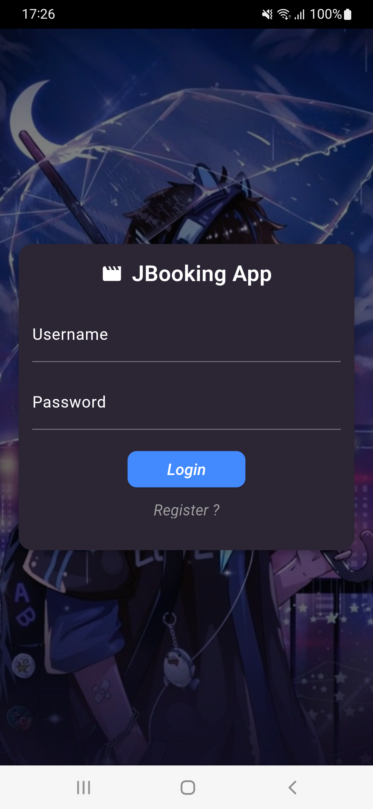
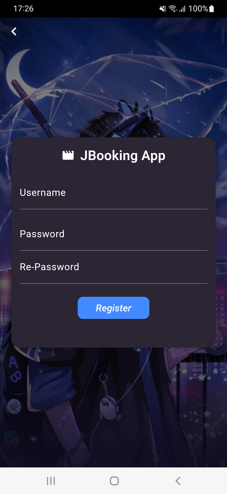
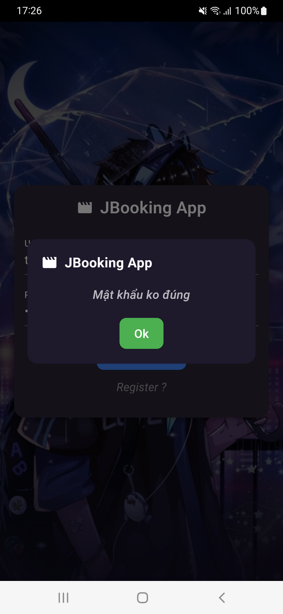

# Movie Ticket Booking

A movie tickets booking and application using **Flutter** and **Nodejs Express**.

## Features

- Using MVVM Architecture
- Flutter BloC pattern and Provider, GetX for state management
- Backend using Nodejs Express, Mongodb database

## View Screenshots

